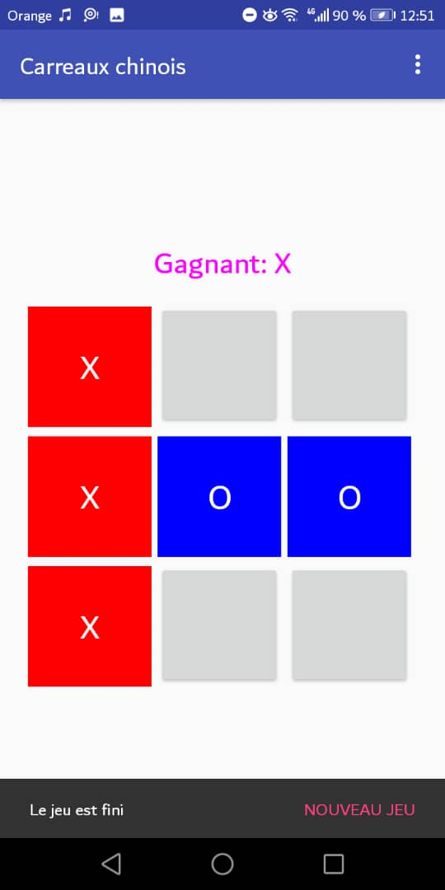
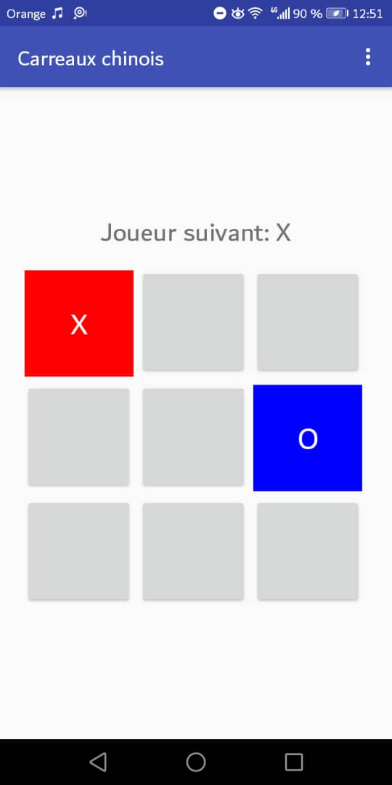

# carreauxchinois
C'est un jeu à 9 cases dans lequel deux utilisateurs s'affrontent et y joue tour à tour dans l'optique d'y aligner(verticalement, horizontalement ou diagonalement) 3 pions pour gagner sinon si toutes les cases sont remplis sans que l'un n'est pu abouti à l'alignement, le game s'arrête.

Voici quelques images du jeu en question:

  
  
  

